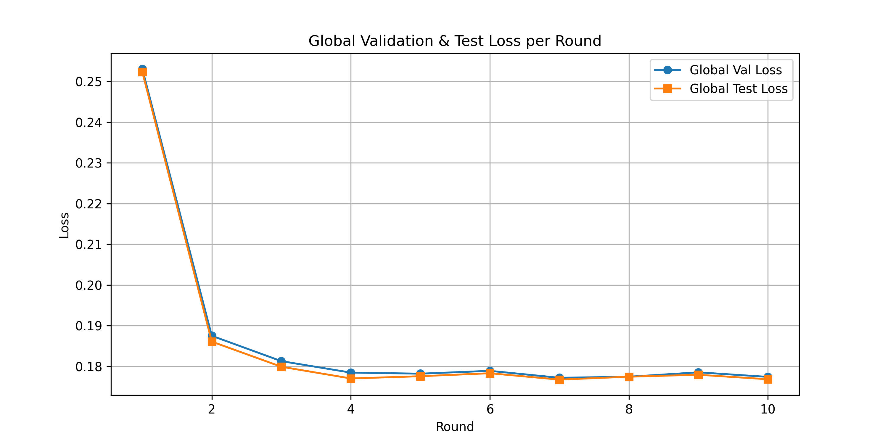
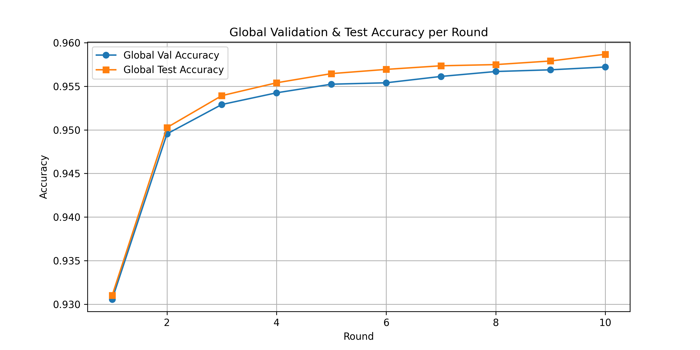

# Federated Learning (FL) with MLP on HuGaDB

This project implements **Federated Learning (FL)** using a **Multi-Layer Perceptron (MLP)** for the **HuGaDB** human gait dataset.

---

##  Federated Learning Pipeline

Each Federated Learning round in `fl.py` follows **three main steps**:

---

### **1️⃣ Local Training**

* The server sends the current **global model** to every client.
* Each client trains this model on its **own local dataset** for a few epochs
  (handled in `train_client()` → the loop `for _ in range(epochs)`).

---

### **2️⃣ Model Aggregation (FedAvg)**

* The server collects updated client models.
* It performs **weighted averaging**, where each client’s weight is proportional to its dataset size.

---

### **3️⃣ Global Evaluation**

The aggregated global model is evaluated on:

* **Validation set** → used for tracking improvement & early stopping
* **Test set** → used to monitor global performance each round

All metrics are logged into CSV files and can be plotted afterward.

---

##  Usage

### **Run the Federated Learning Experiment**

To run the federated learning simulation, execute the main script:

```bash
python fl.py
```

### **Generate Result Plots**

To visualize the results after training:

```bash
python plots.py
```

---

##  Results

Generated figures are stored in the **`fig/`** directory.

* **Global Loss Curve**
  `fig/global_loss.png`



* **Global Accuracy Curve**
  `fig/global_accuracy.png`


---
